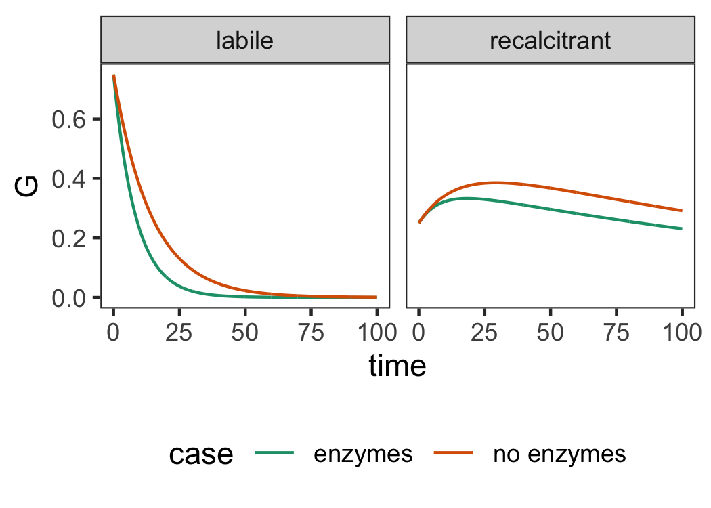

OM decay with and without exoenzymes
================
Drew

To make the point that exoenzymes doesn’t just affect labile organic
matter, I have made a simple, two-component model, which contains labile
and recalcitrant organic matter. Both labile and recalcitrant OM decay,
but in order to capture the effect of abiotic reactions, labile OM is
slowly converted to recalcitrant OM by, for instance, photochemistry
([Tranvik and Bertilsson
2001](https://onlinelibrary.wiley.com/doi/full/10.1046/j.1461-0248.2001.00245.x?casa_token=bPAvbpSsrowAAAAA%3Alg4u2CUXHlJGM0zy17ufH7Q-dG32LKE_l8B7H7Ed1IudfPYP0P1_KofEs2QkbdOdJ1A6LFC72Mooe5RG)).

The model is thus:

I’ve solved these differential equations using the `deSolve` package for
R, and the following rate constants:

|            | $k_l$ | $k_{l \rightarrow r}$ | $k_r$ |
|------------|-------|-----------------------|-------|
| enzymes    | -0.01 | -0.002                | 0.005 |
| no enzymes | -0.05 | -0.002                | 0.005 |

I’ll spare you the code, but the model plot looks like this:

